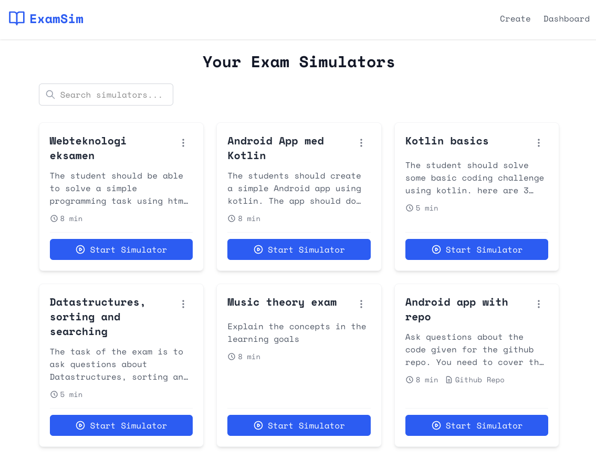

# Multimodal Exam Simulator

A modern application that helps students prepare for oral exams by simulating realistic exam environments using AI-powered examiners.



## Features

- **Dynamic Exam Environments**: Practice with various exam types including standard and Github repository-based exams
- **Customizable Examiners**: Choose friendly, strict, or other examiner personalities 
- **Real-time Feedback**: Get immediate evaluation of your performance
- **Adjustable Duration**: Set custom time limits for your practice sessions
- **Countdown Timer**: Visual tracking of your remaining exam time
- **Learning Goal Assessment**: Customize which competencies you want to be evaluated on
- **Multiple Grading Systems**: Support for 7-point scale, pass/fail, and more

## Setup

### Prerequisites
- Node.js (v14 or later)
- npm or yarn
- Chrome browser (recommended for optimal experience)

### Getting Started
1. Clone this repository to your local machine
   ```bash
   git clone https://github.com/behu-kea/Exam-simulator.git
   cd multimodal-exam-simulator
2. Get a Google Gemini API key and an OpenAI key
- Visit: https://aistudio.google.com/apikey Follow the instructions to create your API key
- Visit: https://platform.openai.com/settings/organization/api-keys to get an OpenAI key

3. Add the keys to the .env file in the project root. DONT COMMIT THE KEYS!!!

4. Install dependencies and start the application
````
npm install
npm run start
````

5. Open the application in your browser
- The development server will typically start at http://localhost:3000
- You can find the exact URL in your terminal output

## Usage
1. From the dashboard, select an exam type or create a new custom exam
2. Configure exam settings (duration, examiner type, learning goals)
3. Start the exam and practice answering questions
4. Receive feedback and a grade at the end of your session
5. Review your performance and try again to improve

## Contributing
Contributions are welcome! Please feel free to submit a Pull Request.
